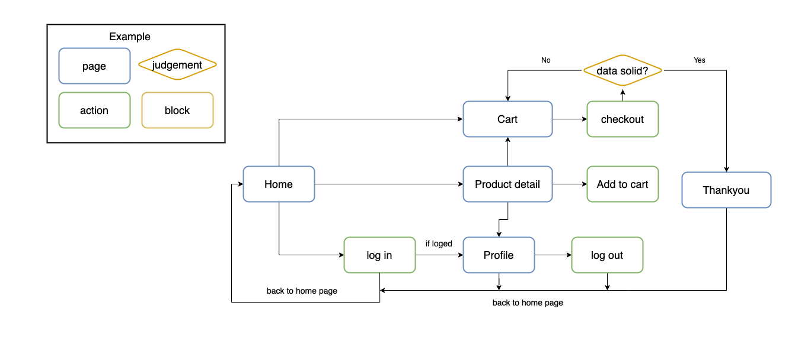

# STYLiSH
A completed e-commerce platform with plentiful product details, intuitive user experience and fluent checkout process.

## Website Link

Link: <https://dragonlonss99.github.io/STYLiSH/>\
You can use your Facebook account to login, but logging in is not necessary to try the website.

## Techniques

* Front-End Web Design
    + HTML / CSS / JavaScript
    + RWD
* Firebase
    + Hosting
* Third Party Services
    + Facebook log in SDK
    + TapPay SDK
    + Google Analytics
* Other
    + Version Control : Git / GitHub
    + Lint : ESLint

## User Flow

## Website Demo
Home page 

Product detail page

Cart page before check out

## Contact
If you got any problem when using STYLiSH, or had any suggestion about it. Please feel free to contact with me via email.\
E-mail: <dragonlonss@gmail.com>
